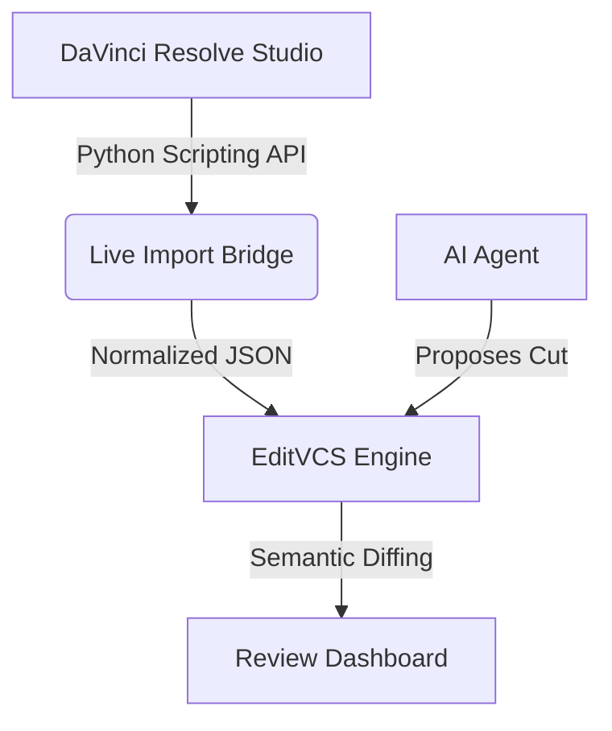

# EditVCS ✦

**Pull requests for AI video edits.**

EditVCS is a version control system for non-linear editors (NLEs). It captures structured edits from human editors and AI agents, creates reviewable change requests, shows a semantic video diff, and lets a human approve or selectively apply the changes.

## The Architecture (Phase 1: Read-Only Live Import)

EditVCS currently integrates directly with **DaVinci Resolve Studio**. It pulls a live snapshot of your active timeline, normalizes it into domain files (Cuts, Audio, Captions, Color), and powers a visual dashboard.



## What's Supported (Phase 1)
- ✅ **Reading Active Timeline:** Extracting video, audio, captions, and markers from live Resolve instances.
- ✅ **Snapshotting:** Storing deterministic versions of your timeline without copying heavy media files.
- ✅ **Semantic Diffs:** Intelligent string-based summaries of changes (e.g., `"Trimmed clip 'A-Roll.mp4' by 24 frames."`).
- ✅ **Review Proposals:** Creating GitHub-style pull requests for AI agents to submit edits for review.
- ✅ **Dashboard Sync:** A local React/Vanilla web app that syncs with Resolve to show your timeline health.

## What's NOT Supported (Phase 1)
- ❌ **Editing an existing Resolve timeline:** Resolve's API does not support mutating an existing timeline's clips directly.
- ❌ **Applying agent edits into Resolve:** You can approve them in the EditVCS dashboard, but currently you must manually replicate the cuts in Resolve.
- ❌ **Complex feature preservation:** Multicam, compound clips, and complex Fusion graphs are not fully round-tripped yet.

---

## 🚀 PHASE 2 — SAFE WRITE-BACK (Coming Next)
In Phase 2, we will implement **Safe Write-Back**. EditVCS will export approved proposals as a new FCPXML/OTIO package and ask Resolve to import it as a **NEW** timeline. 
* EditVCS will **never** overwrite your active timeline.
* The original timeline is preserved untouched.
* Explicit user confirmation will be required before any import.

---

## Setup & Installation

### Supported Platforms
- Windows 10/11
- macOS 12+
- Linux (CentOS/Ubuntu)

### DaVinci Resolve Prerequisites
You must have **DaVinci Resolve Studio** installed to use the live Python Scripting API.
Ensure Python 3.6+ is installed on your system.

If the script fails to find Resolve's modules automatically, set the environment variable:
- **Windows:** `set EDITVCS_RESOLVE_SCRIPT_PATH="%PROGRAMDATA%\Blackmagic Design\DaVinci Resolve\Support\Developer\Scripting\Modules"`
- **macOS:** `export EDITVCS_RESOLVE_SCRIPT_PATH="/Library/Application Support/Blackmagic Design/DaVinci Resolve/Developer/Scripting/Modules"`

### Initializing a Project

```bash
# 1. Initialize a new EditVCS tracking folder in your directory
editvcs init "Podcast Episode 14" --adapter davinci-resolve
```

### Live Syncing
Make sure DaVinci Resolve is open, a project is loaded, and a timeline is active.

```bash
# Pulls the active timeline and commits it
editvcs import --live

# Optional flags:
# editvcs import --live --redact-media-paths
```

If you do not have DaVinci Resolve installed, you can test EditVCS using fallback mock fixtures:
```bash
editvcs import ./fixtures/resolve/podcast_episode_base.json
```

### Review Dashboard
Start the local review server to approve or reject Edit Proposals:
```bash
editvcs serve
```
Open `http://localhost:3333` in your browser.

---

## Demo Automation
If you just want to see the whole system working without DaVinci Resolve, run the setup script!

```bash
npm install
npm run build
npx tsx scripts/setup-demo.ts
cd demo_project
node "../dist/cli/index.js" serve
```
This generates a mock base timeline, creates an agent branch, commits a trim + audio boost on behalf of "HookAgent", and opens a Review Request!
