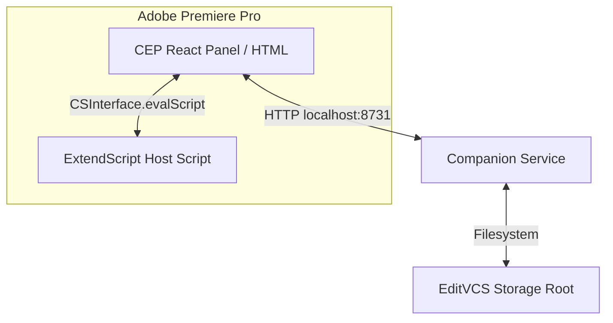
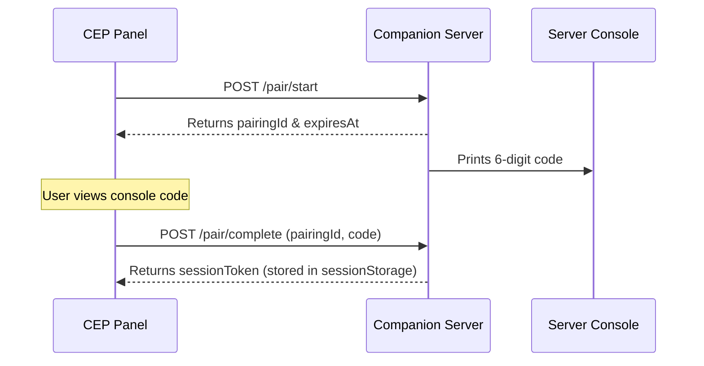
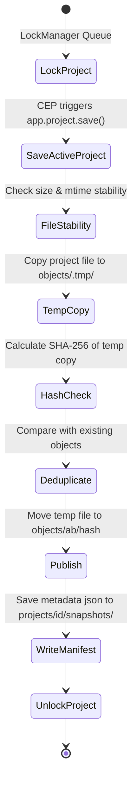

# EditVCS System Architecture

This document describes the architectural design and data flow of EditVCS (Phase 1), a local-first version control system for Adobe Premiere Pro projects.

---

## 1. Canonical CEP Architecture

EditVCS uses Adobe Common Extensibility Platform (CEP) to run an embedded Chromium browser (CEF) and a Node.js runtime inside Adobe Premiere Pro.



* **CEP Panel (React):** Runs in the Chromium CEF browser window. It provides the user interface (pairing, history lists, manual save points, timeline diff comparisons). It communicates with the host application via `CSInterface` and queries the Companion Service over HTTP.
* **ExtendScript (hostscript.jsx):** Runs in a separate JSX engine inside Premiere Pro. It has direct access to the Premiere DOM. It performs operations like saving the active project (`app.project.save()`) and extracting timeline metadata (active sequence tracks, clips, in/out points, and framerates).
* **Node.js Integration:** The CEP panel has `--enable-nodejs` and `--mixed-context` enabled, allowing it to leverage Node libraries for environment checking (such as detecting whether running inside Adobe CEP).

---

## 2. Companion Service

The companion service is a lightweight, local-first backend that manages versioning mechanics independently of Premiere's thread.

* **Single Executable Bundle:** To resolve Node ESM relative imports issues (`ERR_MODULE_NOT_FOUND`), the service is bundled using `esbuild` into a single CommonJS executable located at `dist/companion.cjs`.
* **Express HTTP Server:** Listens on `127.0.0.1:8731`. It handles requests for pairing, project registration, manual save point creation, restoration, changes diffing, and file watching.
* **Middlewares & Security:** Enforces strict CORS (only localhost and CEP no-origin headers allowed), rate-limits pairing completions, and restricts access to sensitive routes using JWT-style bearer session tokens.

---

## 3. Secure Pairing Flow

Authentication is required before the panel can communicate with local companion endpoints.



1. **Initiation:** The panel sends a `POST /pair/start` request. The companion generates a secure random 6-digit pairing code and a `pairingId`, storing them in an in-memory map. The code is *never* sent back in the HTTP response; instead, it is output to the local server's stdout console.
2. **Completion:** The user inputs the 6-digit code in the panel. The panel sends `POST /pair/complete` containing the `pairingId` and `code`. The companion validates the input using a timing-safe comparison (`crypto.timingSafeEqual`).
3. **Throttling & Lifecycle:** Pairing codes expire after 60 seconds. A maximum of 5 invalid pairing attempts are allowed per ID; a 60-second lockout is triggered if this is exceeded.
4. **Session Management:** Upon successful pairing, a session token is generated, hashed with SHA256, and returned to the panel (which stores it in `sessionStorage`). Sessions can be rotated via `POST /sessions/refresh` or revoked via `POST /sessions/revoke`.

---

## 4. Project Registry

The project registry acts as a persistent directory mapper between creative project file paths and unique `projectId` UUIDs.

* **Case-Insensitive Normalization:** On Windows, paths are normalized and compared case-insensitively (`path.normalize(p).toLowerCase()`) to prevent duplicate mapping registrations caused by varying drive letters or path cases.
* **Path Validation:** Before registering, the companion verifies that the path:
  * Exists and represents a regular file (not a folder, pipe, or symlink).
  * Has a `.prproj` extension.
  * Is not a device path (such as `\\\\.\\` or `COM1`) or network path (for Phase 1).
* **Atomic Persistence:** Mappings are saved in `registry.json` at the storage root. Writes are performed atomically (writing to a temp file first, then renaming) to prevent corruption during system crashes.

---

## 5. Snapshot Lifecycle

Snapshots represent immutable point-in-time states of registered project files.



1. **Project Locking:** The companion places incoming snapshot requests in a sequential queue (`LockManager`) per `projectId`. This prevents concurrent writes or race conditions on the same project files.
2. **File Stability Check:** The companion polls the `.prproj` file stats. It waits until the file size and modified timestamp (`mtime`) remain unchanged across sequential stat polls (with a 2-second stability threshold and up to 3 retries).
3. **Transaction Copying:** The file is copied to a temporary UUID-named file under `<storage-root>/objects/.tmp/`.
4. **Hashing & Deduplication:** The temporary copy is hashed (SHA256). If an object with the same hash already exists and passes file size validation, the temporary copy is deleted to save space. Otherwise, it is moved to its content-addressed location: `<storage-root>/objects/<first-two-chars-of-hash>/<hash>`.
5. **Manifest Generation:** A snapshot metadata manifest (JSON) is created containing metadata (timestamp, label, project file hash, and active timeline clips). The manifest is saved atomically under `<storage-root>/projects/<projectId>/snapshots/`.

---

## 6. Storage Format

All repository metadata and objects are stored in a centralized, platform-specific user directory:
* **Windows:** `%APPDATA%/EditVCS/`
* **macOS:** `~/Library/Application Support/EditVCS/`
* **Linux:** `~/.local/share/EditVCS/`

```text
EditVCS/
├── config.json
├── registry.json
├── projects/
│   └── <project-uuid>/
│       ├── state.json
│       └── snapshots/
│           └── snap_<timestamp>_<hash-prefix>.json
└── objects/
    ├── .tmp/
    │   └── <uuid>.tmp
    └── ab/
        └── <sha256-hash>
```

---

## 7. Restore Lifecycle

Restore actions recreate a creative project file from a content-addressed snapshot, without ever modifying or overwriting the active project file.

1. **Request Verification:** The client sends `projectId`, `snapshotId`, and a `destinationDirectory` path.
2. **Destination Validation:** The companion ensures the destination folder exists, is writable, is not inside the object store, and does not canonicalize to the active project file path (preventing accidental self-overwrites).
3. **Sanitization & Collision Avoidance:** A file name is generated using the schema: `${originalName}_restored_${label}_${date}.prproj`. Separators are stripped, and if a file already exists at that path, it appends an incrementing counter (e.g., `_copy_1`, `_copy_2`).
4. **Copy & Inode Checks:** The object is copied using `COPYFILE_EXCL`. Once copied, its size and inode/device stats are checked against the active project file to confirm they do not point to the same physical disk location.
5. **Registry Intactness:** The active project registry mapping remains unchanged; the restored file is a completely separate copy.
